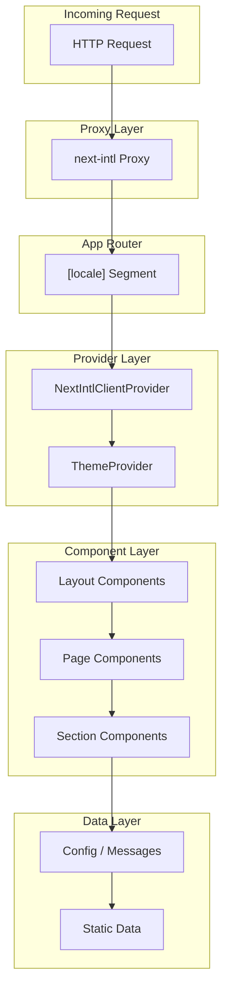

# Architecture Overview

This document describes the high-level architecture of the Portfolio application, including the request flow, layer responsibilities, and React Server Components (RSC) strategy.

---

## Request Flow

Every incoming request passes through the following pipeline:

### Flow Description

1. **Proxy** — The `next-intl` proxy intercepts requests to handle locale detection, redirects (e.g., `/` → `/en` or default locale), and locale prefix management. It runs before any page is rendered.

2. **App Router [locale]** — Next.js App Router routes requests into the `[locale]` dynamic segment. Each locale (e.g., `en`, `es`, `fr`) shares the same route structure but receives locale-specific content.

3. **Providers** — The root layout wraps the application with:
   - **NextIntlClientProvider** — Supplies translation messages and locale context to client components.
   - **ThemeProvider** (next-themes) — Manages dark/light/system theme and persists user preference.

4. **Components** — The UI is composed of layout components (Header, Footer), page components (home, about, contact, projects), and section components (Hero, Skills, ProjectsShowcase, etc.).

5. **Data Layer** — Configuration (`site`, `navigation`, `projects`), translation messages, and static data are loaded server-side and passed down to components.

---

## Three-Layer Model

The application is organized into three conceptual layers:

### 1. Presentation Layer (Pages)

- **Location:** `src/app/[locale]/`
- **Responsibility:** Route definitions, page composition, metadata generation, and data fetching.
- **Characteristics:** Uses React Server Components by default. Pages orchestrate sections and pass data from config/messages.

### 2. Component Layer (UI)

- **Location:** `src/components/`
- **Subdirectories:**
  - `ui/` — Primitive shadcn/ui components (Button, Card, Dialog, etc.)
  - `layout/` — Header, Footer, LocaleSwitcher, ThemeToggle, MobileNav
  - `sections/` — Page sections (Hero, Skills, AboutPreview, ProjectsShowcase, ContactCta)
  - `shared/` — Reusable domain components (ProjectCard, SkillBadge, AnimatedWrapper, SectionHeading)
  - `providers/` — ThemeProvider and other context providers
- **Responsibility:** Reusable UI building blocks. Components receive props and render markup. Client components (e.g., interactive elements) use `"use client"` where needed.

### 3. Data / Config Layer

- **Location:** `src/config/`, `src/lib/`, `messages/`, `src/i18n/`
- **Responsibility:** Site configuration, project data, navigation structure, translation messages, and utility functions.
- **Characteristics:** Pure data and config. No React components. Used by pages and components via imports or server-side data loading.

---

## RSC Strategy

### Default: Server Components

- All components are **React Server Components (RSC)** by default.
- RSCs run only on the server, reducing client bundle size and improving initial load performance.
- They can directly access server resources (filesystem, database, env vars) and async data.

### Client Components When Needed

Use `"use client"` only when:

- Interactivity is required (onClick, onChange, useState, etc.)
- Browser APIs are needed (localStorage, window, etc.)
- Third-party libraries require client-side execution
- Animation libraries (e.g., Motion) need client-side rendering

**Examples of client components in this project:**

- `ThemeToggle` — Reads/writes theme preference
- `LocaleSwitcher` — Handles locale selection and navigation
- `MobileNav` — Manages mobile menu open/close state
- `AnimatedWrapper` — Uses Motion for animations
- `Command` (cmdk) — Search/command palette

### Composition Pattern

- Keep client components as leaf nodes or small subtrees.
- Pass server-fetched data as props to client components to avoid unnecessary client-side fetching.
- Use Server Components for layout, metadata, and static content; Client Components for interactive UI.
