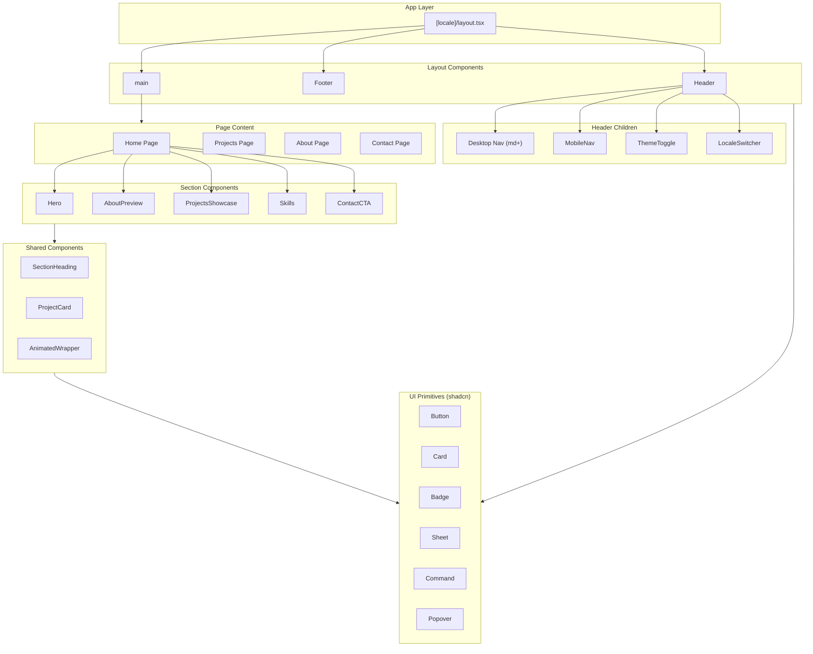

# Component Overview

This document describes the component architecture, naming conventions, and composition patterns used in the portfolio application.

## Component Hierarchy



## Naming Conventions

### Components

- **PascalCase** for all React component names (e.g., `SectionHeading`, `ProjectCard`, `ThemeToggle`).
- Components are exported as named exports, not default exports.

### Files

- **kebab-case** for all component file names (e.g., `section-heading.tsx`, `project-card.tsx`, `theme-toggle.tsx`).
- One component per file; the file name matches the primary export.

| Component Name   | File Path                                   |
| ---------------- | ------------------------------------------- |
| `SectionHeading` | `src/components/shared/section-heading.tsx` |
| `ProjectCard`    | `src/components/shared/project-card.tsx`    |
| `ThemeToggle`    | `src/components/layout/theme-toggle.tsx`    |
| `LocaleSwitcher` | `src/components/layout/locale-switcher.tsx` |

## Server vs. Client Component Strategy

The application follows a **default Server Component** approach with explicit client boundaries.

### Default: React Server Components (RSC)

- Layout components that render static structure (e.g., `Footer`) are Server Components by default.
- Page components and content that do not require interactivity remain Server Components.
- Benefits: smaller bundle size, better SEO, faster initial load.

### Client Components: `"use client"` Only When Needed

Add `"use client"` at the top of a file **only** when the component requires:

| Requirement            | Example                                                                     |
| ---------------------- | --------------------------------------------------------------------------- |
| **Interactivity**      | `useState`, `useEffect`, event handlers beyond simple links                 |
| **Browser APIs**       | `window`, `localStorage`, `matchMedia`                                      |
| **Animations**         | Framer Motion / Motion library                                              |
| **Theme/Locale hooks** | `useTheme`, `useLocale`, `useTranslations` (when used for dynamic behavior) |

### Examples

```tsx
// Server Component (no directive)
// src/components/layout/footer.tsx
export function Footer() {
  const t = useTranslations("footer");
  return <footer>...</footer>;
}

// Client Component (requires scroll state)
// src/components/layout/header.tsx
"use client";
export function Header() {
  const [scrolled, setScrolled] = useState(false);
  useEffect(() => { /* scroll listener */ }, []);
  return <header>...</header>;
}

// Client Component (requires Motion)
// src/components/shared/animated-wrapper.tsx
"use client";
import { motion } from "motion/react";
export function FadeIn({ children }) { ... }
```

## Props Conventions

### TypeScript Interfaces

All component props are typed with explicit interfaces:

```tsx
interface SectionHeadingProps {
  title: string;
  subtitle?: string;
  className?: string;
}

export function SectionHeading({
  title,
  subtitle,
  className,
}: SectionHeadingProps) {
  // ...
}
```

### Common Patterns

- **`className?: string`** — Optional for layout/spacing overrides.
- **`children: React.ReactNode`** — For wrapper components.
- **Domain types from `@/types`** — Use `Project`, `Skill`, `LocaleConfig` for typed props.

### Example: Typed Props

```tsx
// src/components/shared/project-card.tsx
import type { Project } from "@/types";

interface ProjectCardProps {
  project: Project;
}

export function ProjectCard({ project }: ProjectCardProps) {
  // project is fully typed
}
```

## Directory Structure

```
src/components/
├── layout/          # Header, Footer, MobileNav, ThemeToggle, LocaleSwitcher
├── sections/        # Hero, AboutPreview, ProjectsShowcase, Skills, ContactCTA
├── shared/          # SectionHeading, ProjectCard, AnimatedWrapper
├── ui/              # shadcn/ui primitives (button, card, badge, etc.)
└── providers/       # ThemeProvider
```
